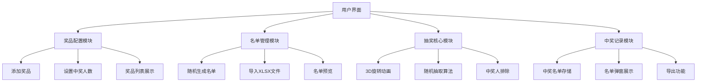

# 3D抽奖系统设计文档

## 1. 系统架构



## 2. 功能模块

### 2.1 奖品配置
- 支持添加多个奖品
- 每个奖品可设置名称和中奖人数
- 左侧固定显示奖品列表和剩余名额

### 2.2 名单管理
- 随机生成测试名单（姓名、手机号、部门）
- 支持导入XLSX格式文件
- 名单预览和管理

### 2.3 3D抽奖动画
- CSS3 3D旋转效果
- 姓名在屏幕中央旋转展示
- 平滑的开始/停止动画

### 2.4 中奖记录
- 中奖人自动排除后续抽奖
- 中奖名单按奖品分组展示
- 弹窗查看完整中奖记录

## 3. 技术选型

| 模块 | 技术方案 |
|------|----------|
| 核心框架 | 原生HTML5 + CSS3 + JavaScript |
| 3D动画 | CSS3 Transform + Keyframes |
| XLSX解析 | SheetJS (xlsx.js) |
| UI组件 | 自定义CSS组件 |
| 数据存储 | LocalStorage |

## 4. UI/UX规范

### 4.1 色彩方案
- 主色调：#e74c3c (红色，喜庆)
- 辅助色：#f39c12 (金色)
- 背景色：#1a1a2e (深蓝黑)
- 文字色：#ffffff (白色)
- 卡片背景：rgba(255,255,255,0.1)

### 4.2 字体规范
- 标题：28px, bold
- 正文：16px, normal
- 抽奖姓名：48px, bold

### 4.3 间距规范
- 卡片内边距：20px
- 元素间距：16px
- 按钮圆角：8px

## 5. 文件结构

```
frontend-lottery/
├── index.html          # 主页面
├── css/
│   └── style.css       # 样式文件
├── js/
│   ├── app.js          # 主逻辑
│   ├── lottery.js      # 抽奖核心
│   ├── storage.js      # 数据存储
│   └── xlsx.full.min.js # XLSX解析库
├── assets/
│   └── default-bg.jpg  # 默认背景
├── Dockerfile          # Docker配置
└── nginx.conf          # Nginx配置
```
